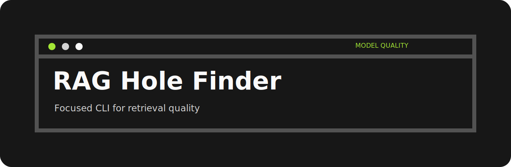
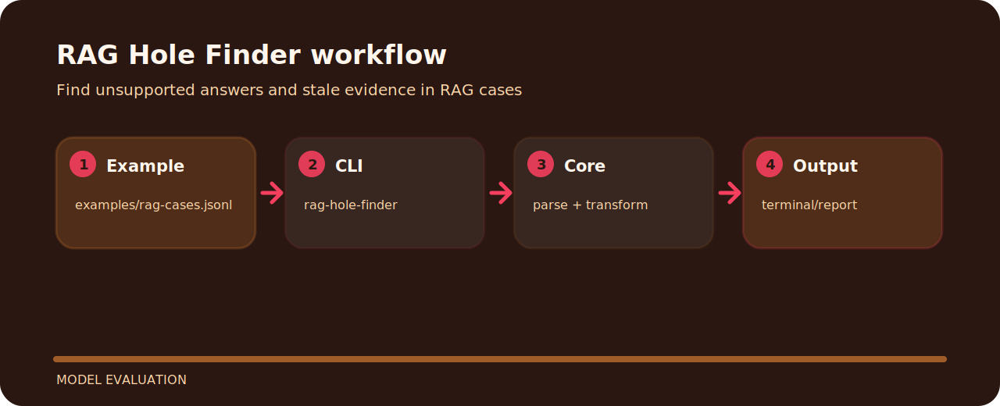

# RAG Hole Finder



This project is a small, inspectable model evaluation tool. It prefers concrete examples and local files over hidden setup.

## Command line

```bash
git clone https://github.com/mertefekurt/rag-hole-finder.git
cd rag-hole-finder
python -m pip install -e ".[dev]"
rag-hole-finder examples/rag-cases.jsonl --min-overlap 0.25
```

## File map

```text
.github/        CI workflow
examples/       sample inputs
src/            package source
tests/          test coverage
.gitignore      project file
pyproject.toml  package metadata
```

## Shape of the tool


